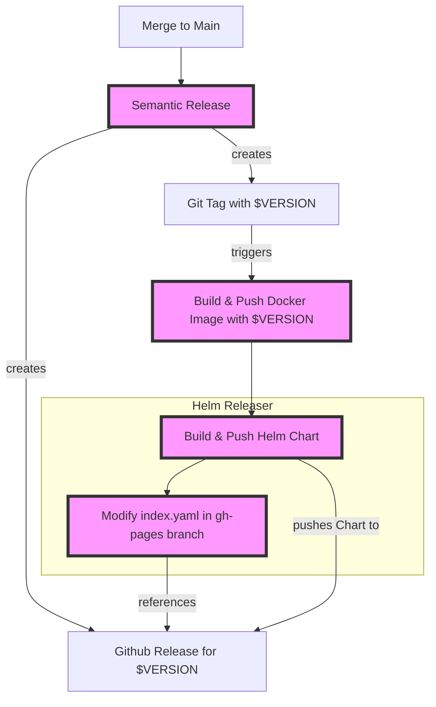

# CI Workflow on Merges

This diagram shows the workflow that runs whenever a commit is added to the
`main` branch. The pink nodes denote jobs that run in CI.

```mermaid
flowchart TD
    classDef ciJob fill:#f9f,stroke:#333,stroke-width:4px;
    A[Merge to Main] -->B[Semantic Release]:::ciJob
    B -- creates --> C[Git Tag with $VERSION]
    B -- creates -->  D[Github Release for $VERSION]
    C -- triggers --> E[Build & Push Docker Image with $VERSION]:::ciJob
    E --> F[Push Helm Chart to Github Release]
    subgraph Helm Releaser
    F[Build & Push Helm Chart]:::ciJob --> G[Modify index.yaml in gh-pages branch]:::ciJob
    end
    G -- references --> D
    F -- pushes Chart to --> D
```
